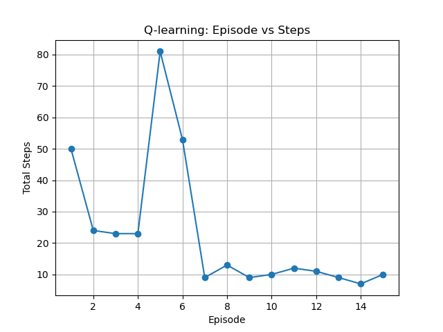

# Implement Q-learning on a 1-dimension world

## Environment setting 
A simple 1 dimension world made with "---------T", where the agent "👻" is walking inside this 1 dimension world. The agent have two actions: `left` and `right`.

## What are expected in the output

After several episodes, you are expected to see the following agent movement for each step, from start to the target `T`.

👻------T

-👻-----T

--👻----T

---👻---T

----👻--T

-----👻-T

------👻T

Episode 14: total steps = 6

And a plot of total steps for each episode will be shown in the following way:

## Dependencies and Versions
To check your current version of python: type `python --version` in a command window.
To view your current version of package in python: type `pip show your_package_name` in a command window.
1. python version: `python 3.13.5`
2. numpy version: `numpy 2.1.3`
3. pandas version: `pandas 2.2.3`
4. matplotlib version: `3.10.0`

## Q-learning Algorithm
The core idea of Q-Learning algorithm is to update optimal action values ($q$-values) in a Temporal-Difference way. Temporal-Difference learning or TD learning is a fundamental idea of Q-learning. What's different is that TD learning is updating the state values while Q-learning is updating optimal $q$-values. A bridge between the two algorithms is called SARSA, an algorithm that estimates $q$-values. 

Core function of Q-learning algorithm:

### Update $q$-value for $(s, a)$
$$
Q(s,a) \leftarrow Q(s,a) + \alpha \Big[r + \gamma \max_{a'} Q(s', a') - Q(s,a)\Big]
$$

On the left:

$\bullet$ $Q(s, a)$ is the new estimate of $q$-value.

On the right:

$\bullet$ $Q(s, a)$: Current estimate of $q$-value under state $s$ and action $a$.

$\bullet$ $\alpha \in (0, 1]$: Learning rate for each update. 

$\bullet$ $\gamma \in (0, 1]$: Discount factor (how much future rewards are worth)

$\bullet$ $r$: Direct reward from the action $a$.

$\bullet$ $s'$: Next state.

$\bullet$ $\max_{a'} Q(s', a')$: Estimated value of the best action in the next state.

$\bullet$ $r + \gamma \max_{a'} Q(s', a')$ is seen as $Q$ target. 

### Update policy for $s$

Here we use $\epsilon$-greedy to choose our next action and update our policy to go from $s$ to $s'$.

Firstly we get all actions of that state from $q$-table: `state_actions = q_table.iloc[state, :]`.

Next we choose our action based on two rules:

(1) We generate a random number with `np.random.uniform()`, if it is larger than $\epsilon$, we randomly choose an action from action space, `left` and `right`. Otherwise, we choose that action with the largest $q$-value: `state_actions.idxmax()`

(2) If that state has never been explored, meaning `state_actions.all()==0`, we also randomly choose an action from action space, `left` and `right`.

After taking the action `right`, if the next state is our target `T`, we then get a reward. If the next state is not target `T`, no reward.

After taking the action `left`, if the next state is hitting the start point's left wall, we stay at the start point. Otherwise, we move more to the left. Both without reward.

Then we get our next state $s'$.
